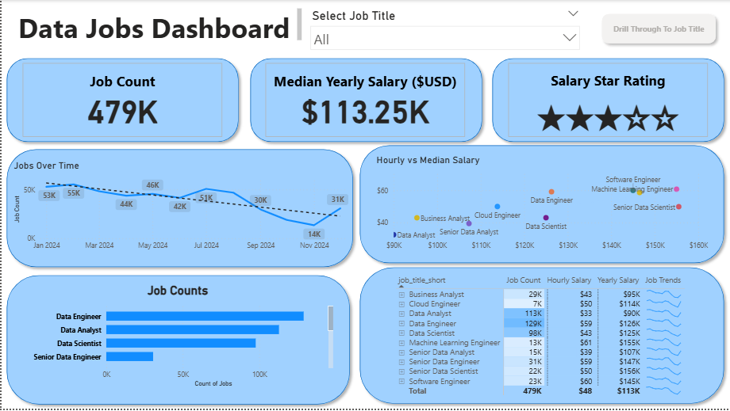
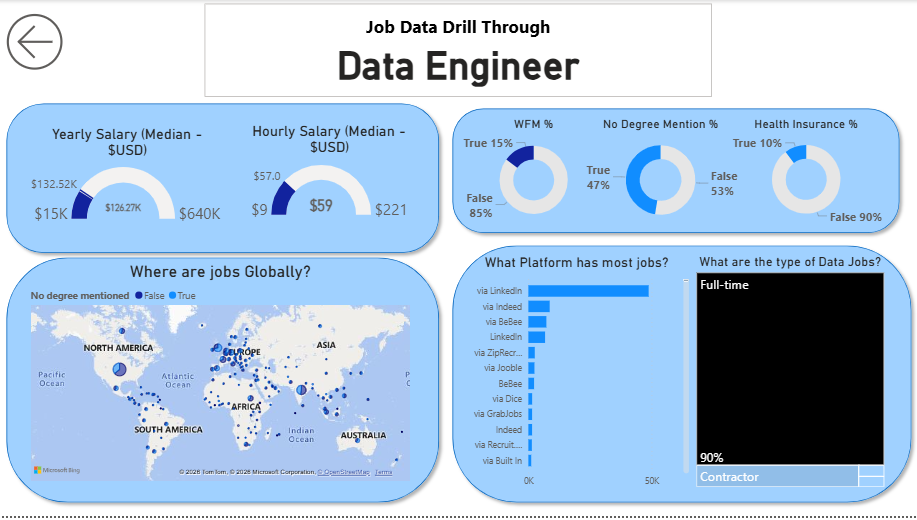

# Data Jobs Dashboard [Power Bi]

# Introduction

This dashboard was designed for **Job Seekers, Career Transitioners, and Professionals exploring new opportunities** who want a clearer understanding of the data job market. 

Using a real-world dataset containing **2024 data science job postings**, including job titles, salaries, and locations, this project brings everything together into an interactive Power BI dashboard that makes exploring the market simpler and more intuitive.

# Dashboard File

You can find the Power BI dashboard file here:

[📊 Download the Power BI Dashboard](./DataJobsDashboard.pbix)

# Skills Showcased

This project provided hands-on experience with several key Power BI features and concepts:

⚙️ **Data Transformation (ETL) with Power Query:** Cleaned and prepared raw job posting data by handling missing values, adjusting data types, and creating new columns for analysis.

🧮 **Measures & KPIs:** Created calculations to generate useful metrics such as **Median Yearly Salary** and **Job Count**.

📊 **Core Visualizations:** Used Column, Bar, Line, and Area Charts to compare job volumes and identify trends over time.

🗺️ **Geospatial Analysis:** Used map visualizations to explore the geographic distribution of data-related job opportunities.

🔢 **Cards & Tables:** Used Cards to highlight important KPIs and Tables to provide more detailed and sortable information.

🎨 **Dashboard Design:** Built a clean and intuitive layout while experimenting with different visual types to present insights effectively.

🖱️ **Interactive Reporting:**

* **Slicers:** Allow users to filter the dashboard dynamically by Job Title.
* **Buttons & Bookmarks:** Improve navigation and make the report easier to explore.
* **Drill-Through:** Allows users to move from a high-level overview into a detailed analysis of a specific job title.

# Dashboard Overview

The report is divided into **two pages**, with each page serving a different purpose: a high-level market overview and a detailed job-specific analysis.

## Page 1: High-Level Market View

**Data Jobs Dashboard — Page 1**

This page provides an overview of the data job market at a glance. It highlights important KPIs such as **total job postings, median salaries, and the most common job titles**, giving users a quick understanding of the overall market.

## Page 2: Job Title Drill-Through

**Data Jobs Dashboard — Page 2**

This page provides a more detailed look at an individual job title. Users can drill through from the main dashboard to explore information such as **salary ranges, work-from-home availability, top hiring platforms, and the geographic distribution of job postings**.

# Conclusion

This dashboard demonstrates how **Power BI can turn raw job posting data into an interactive career research tool**. By combining data transformation, visualizations, KPIs, maps, filters, and drill-through functionality, users can explore the job market from both a broad and job-specific perspective.

Ultimately, the dashboard makes it easier to **compare opportunities, understand salary trends, and explore different career paths using data-driven insights**.
